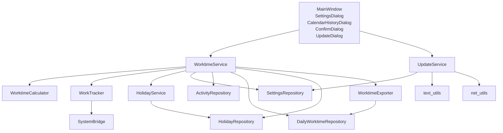

# 工时计算器 架构与调用关系

## 目录结构

| 目录 | 职责 | 核心类 |
|---|---|---|
| `data/` | 数据存储（唯一操作 SQLite 的层） | `Database` 基类 + 4 个 Repository + `models` |
| `core/` | 纯业务逻辑（不直接操作 DB） | `WorktimeCalculator` / `HolidayService` / `WorkTracker` + `date_utils` |
| `services/` | 服务编排（连接 core 与 data） | `WorktimeService` / `WorktimeExporter` / `UpdateService` |
| `ui/` | 界面层（只调 services，禁止直接 import data） | `MainWindow` / `Theme` / 各弹窗 |
| `utils/` | 工具层（无状态纯函数） | `SystemBridge` / `paths` / `text` / `net` / `version` |

## 分层规则

```
UI ──→ Services ──→ Core
  │         │         │
  │         └──→ Data ←┘
  │
  └─ 禁止直接 → Data
```

- **UI 层**只调用 `services` 层，禁止 `from src.data import ...`
- **Core 层**通过构造期注入 Repository，不直接 `import database`
- **Data 层**是唯一直接操作 SQLite 的层
- **Utils 层**是无状态纯函数，可被任意层调用

## 调用关系图



## 模块依赖表

| 调用方 | 被调用方 | 接口方法 |
|---|---|---|
| `MainWindow` | `WorktimeService` | `init` / `poll_and_record` / `get_today_status` / `get_period_stats` / `get_month_stats` / `manual_off` / `resume_after_off` / `check_yesterday` / `get_settings` / `update_settings` / `get_required_hours` / `get_daily_worktime` / `get_all_holidays` / `get_date_range_worktime` / `get_exporter` / `mark_leave` / `manual_record` / `edit_start_time` / `clear_record` |
| `MainWindow` | `UpdateService` | `check_for_updates` / `download_update` / `verify_update` / `install_and_restart` |
| `WorktimeService` | `WorktimeCalculator` | `period_stats` / `month_stats` / `week_stats` / `today_status` / `detect_anomalies` / `previous_workday` |
| `WorktimeService` | `WorkTracker` | `poll` / `check_start_recorded` / `manual_off_work` / `resume_after_off` / `reset_for_new_day` / `is_started` / `is_off` |
| `WorktimeService` | `HolidayService` | `ensure_loaded` / `is_holiday` / `is_adjusted_workday` / `get_all` |
| `WorktimeService` | `SettingsRepository` | `get` / `set` / `get_all` |
| `WorktimeService` | `ActivityRepository` | `record` / `cleanup` / `get_today` |
| `WorktimeService` | `DailyWorktimeRepository` | `get` / `upsert` / `get_range` / `delete` / `clear_end_time` |
| `WorktimeService` | `HolidayRepository` | `get` / `get_all` / `save_year` |
| `WorktimeService` | `WorktimeExporter` | `to_csv` / `to_excel` |
| `WorkTracker` | `utils/system` | `get_hid_idle_seconds` / `is_currently_active` / `get_last_active_time` |
| `HolidayService` | `HolidayRepository` | `get` / `get_all` / `save_year` |
| `WorktimeExporter` | `DailyWorktimeRepository` | `get_range` |
| `UpdateService` | `SettingsRepository` | `get` / `set` |
| `UpdateService` | `utils/text` | `strip_html` |
| `UpdateService` | `utils/net` | `encode_url` |
| `CalendarHistoryDialog` | `WorktimeService` | `get_date_range_worktime` / `get_all_holidays` / `get_setting` / `get_daily_worktime` / `mark_leave` / `manual_record` / `clear_record` / `get_exporter` |
| `SettingsDialog` | （通过参数传入 settings dict） | 不直接调 service |

## 更新规则

每次更新版本/CHANGELOG/发版时，同步检查并更新本文件：
1. 新增/删除/重命名类或方法时，更新「调用关系图」和「模块依赖表」
2. 新增/删除文件时，更新「目录结构」表
3. 新增/修改分层依赖关系时，更新「分层规则」图
